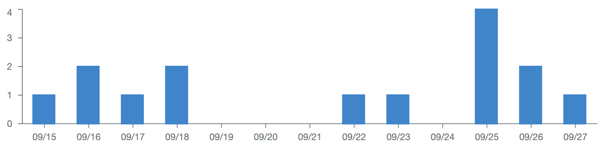
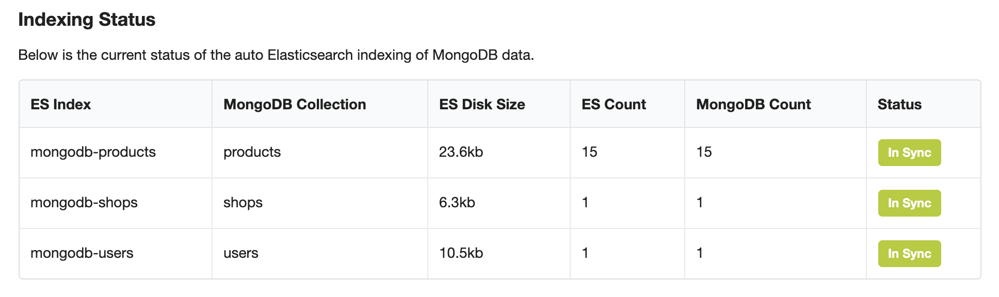

# Bedrock Analytics

This is an analytics Foundation for Bedrock Core. It includes the following:

- API for querying analytics on Elasticsearch
- A micro service for automatically indexing Mongoose data into Elasticsearch
- React components for Elasticsearch querying
- React components for visualizing all of the above

## Installation

```bash
bedrock install @bedrockio/bedrock-analytics
```

## Setup & Configuration

Automatic indexing of Mongoose/MongoDB data is done by running the `mongoose-to-elasticsearch` micro service:

```bash
cd services/mongoose-to-elasticsearch
yarn install
yarn start
```

This service can be configured with the following env variables:

- `MONGO_URI` - source Mongo DB URI, defaults to `mongodb://localhost/bedrock_dev`
- `ELASTICSEARCH_URI` - destination Elasticsearch cluster, defaults to `http://localhost:9200`
- `MONGO_COLLECTIONS_TO_INDEX` - collections to index, defaults to `users,shops,products`
- `MONGO_EXCLUDE_ATTRIBUTES` - collection paths to exclude from indexing, defaults to: `users.email,users.hashedPassword`

Some more advanced options can be found in the `env.conf`

## Example: Basic Visualizations

The following code will query time series of 1 day intervals from Elasticsearch (via the `/1/analytics` API) and then render a bar chart over time:

```js
<TimeSeries index="mongodb-products" operation="count" interval="1d">
  {(data) => {
    return <SeriesChart data={data} height={200} bar valueField="count" />;
  }}
</TimeSeries>
```



The following code will pull an hourly time series of the sum of `priceUsd` for all products and render it as an area chart:

```js
<TimeSeries
  index="mongodb-products"
  operation="sum"
  field="priceUsd"
  interval="1h"
>
  {(data) => {
    return <SeriesChart data={data} height={200} area valueField="value" />;
  }}
</TimeSeries>
```

## Playbooks

### Deployment

### Enabling Analytics Status Screen



### Re-indexing Elasticsearch Data
