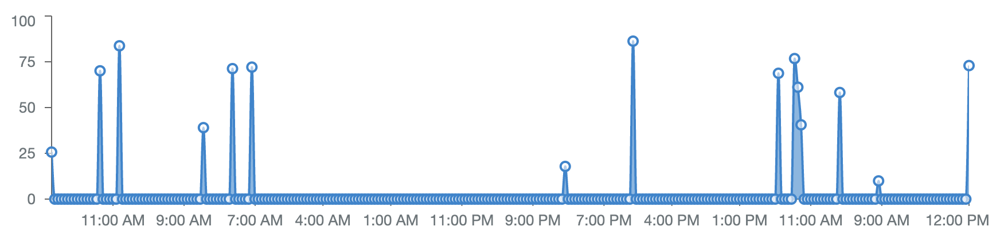
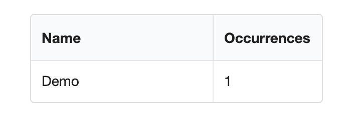
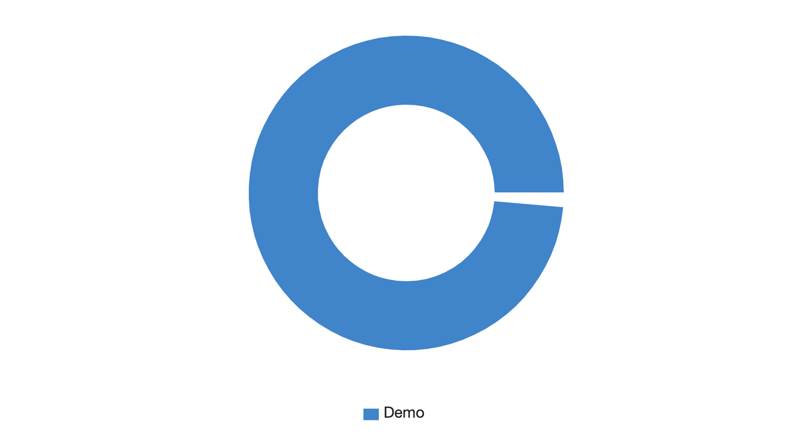
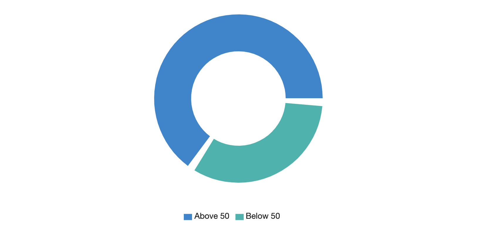

# Bedrock Analytics

This is an analytics Foundation for Bedrock Core. It includes the following:

- API for querying analytics on Elasticsearch
- A micro service for automatically indexing Mongoose data into Elasticsearch
- React components for Elasticsearch querying
- React components for visualizing all of the above

## Installation

```bash
bedrock install @bedrockio/bedrock-analytics
```

## Setup & Configuration

Automatic indexing of Mongoose/MongoDB data is done by running the `mongoose-to-elasticsearch` micro service:

```bash
cd services/mongoose-to-elasticsearch
yarn install
yarn start
```

This service can be configured with the following env variables:

- `MONGO_URI` - source Mongo DB URI, defaults to `mongodb://localhost/bedrock_dev`
- `ELASTICSEARCH_URI` - destination Elasticsearch cluster, defaults to `http://localhost:9200`
- `MONGO_COLLECTIONS_TO_INDEX` - collections to index, defaults to `users,shops,products`
- `MONGO_EXCLUDE_ATTRIBUTES` - collection paths to exclude from indexing, defaults to: `users.email,users.hashedPassword`

Some more advanced options can be found in the `env.conf`

## Example Usage

### Time Series: Bar Chart

The following code will query time series of 1 day intervals from Elasticsearch (via the `/1/analytics` API) and then render a bar chart over time:


Code:

```js
<TimeSeries index="mongodb-products" operation="count" interval="1d">
  {(data) => {
    return <SeriesChart data={data} height={200} bar valueField="count" />;
  }}
</TimeSeries>
```

### Time Series: Area Chart

The following code will pull an hourly time series of the sum of `priceUsd` for all products and render it as an area chart:



Code:

```js
<TimeSeries
  index="mongodb-products"
  operation="sum"
  field="priceUsd"
  interval="1h"
>
  {(data) => {
    return <SeriesChart data={data} height={200} area valueField="value" />;
  }}
</TimeSeries>
```

### Basic Stats

You can use the `Cardinality` component to count the number of unique instances of an attribute:


Code:

```js
<Cardinality index="mongodb-products" fields={["id", "shop"]}>
  {(data) => {
    return (
      <Statistic.Group widths="two">
        <Statistic>
          <Statistic.Value>{data["id"]}</Statistic.Value>
          <Statistic.Label>Products</Statistic.Label>
        </Statistic>
        <Statistic>
          <Statistic.Value>{data["shop"]}</Statistic.Value>
          <Statistic.Label>Shops</Statistic.Label>
        </Statistic>
      </Statistic.Group>
    );
  }}
</Cardinality>
```

### Terms Aggregations

Using the `Terms` you can aggregate attributes. For example, this is to group products by their name and occurences:



Code:

```js
<Terms index={"mongodb-products"} aggField="name" termsSize={10}>
  {(data) => {
    return (
      <Table
        collapsing
        data={data}
        valueField="count"
        valueFieldName="Occurrences"
      />
    );
  }}
</Terms>
```

Or the `DonutChart` representation of the same data:



Code:

```js
<Terms index={"mongodb-shops"} aggField="name" termsSize={10}>
  {(data) => {
    return <DonutChart data={data} limit={8} percent />;
  }}
</Terms>
```

### Advanced Stats

You can use `MultiCardinality` to do multiple unique count queries:



Code:

```js
<MultiCardinality
  fetches={[
    {
      index: "mongodb-products",
      filter: {
        range: {
          priceUsd: {
            gte: 50,
          },
        },
      },
      fields: ["id"],
    },
    {
      index: "mongodb-products",
      filter: {
        range: {
          priceUsd: {
            lt: 50,
          },
        },
      },
      fields: ["id"],
    },
  ]}
>
  {(rawData) => {
    const data = [
      {
        key: "Above 50",
        count: rawData[0].id,
      },
      {
        key: "Below 50",
        count: rawData[1].id,
      },
    ];
    return <DonutChart data={data} limit={8} percent />;
  }}
</MultiCardinality>
```

## Playbooks

### Enabling Analytics Status Screen


There's a `screens/AnalyticsStatus` component which provides an admin only view in the indexing status. It also provides a small kitchen sync for the analytics components above:

In `/services/web/src/App.js`:

```js
import { AnalyticsStatus } from "./screens";
<Protected path="/analytics/status" allowed={AnalyticsStatus} exact />;
```

Then visit: http://localhost:2200/analytics/status

### Deployment

Elasticsearch and MongoDB deployment is provided in Bedrock Core.

The `services/mongoose-to-elasticsearch` deployment is structured similarly to the API deployment:

```yaml
apiVersion: apps/v1
kind: Deployment
metadata:
  name: mongoose-to-elasticsearch-deployment
spec:
  replicas: 1
  selector:
    matchLabels:
      app: mongoose-to-elasticsearch
  template:
    metadata:
      labels:
        app: mongoose-to-elasticsearch
    spec:
      containers:
        - image: gcr.io/bedrock-foundation/bedrock-core-services-mongoose-to-elasticsearch
          imagePullPolicy: Always
          name: main
          env:
            - name: MONGO_URI
              value: "mongodb://mongo:27017/bedrock_staging"
            - name: ELASTICSEARCH_URI
              value: "http://localhost:9200"
            - name: MONGO_COLLECTIONS_TO_INDEX
              value: "users,shops,products"
          volumeMounts:
            - name: cache
              mountPath: /service/data
      volumes:
        - name: cache
          emptyDir: {}
```

### Re-indexing Elasticsearch Data

To wipe out all ES data:

```bash
curl -XDELETE "localhost:9200/mongodb*"
```

The `mongoose-to-elasticsearch` process will automatically recreate and index all data.
